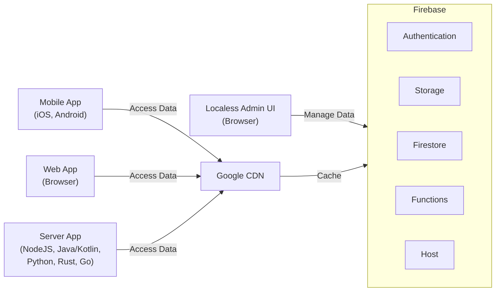

<h1 align="center">
 
  
   
  Localess
 
</h1>

**Localess** is a powerful translation management tool and content management system built using **Angular** and **Firebase**.
With **Localess**, you can easily manage and translate your website or app content into multiple languages, and it uses Artificial Intelligence to translate faster.
The user-friendly interface makes it easy to navigate and the Firebase integration ensures that your translations are stored securely and can be easily accessed from anywhere.
Whether you're a developer looking to expand your app's reach or a business owner looking to expand your online presence in new markets,
**Localess** is the perfect solution for your localization needs.

**Facts**

- It is **Free** forever, you or your company doesn't need to pay.
- It is **Open Source** Software, you also can contribute with code and feedback.
- You pay only for infrastructure where you deploy the **Localess**.

## Supporting Localess & Lessify Project

**Lessify** is an innovative software company focused on open-source technology and simplifying software for users.
With a commitment to transparency and collaboration, Lessify is dedicated to creating user-friendly software accessible to everyone.

**Localess** is part of the **Lessify Project**, is an open source project with its ongoing development made possible entirely by the support of Sponsors.

Our mission is to create software that's accessible, reliable, and easy to use.
By being sponsored on GitHub, we can focus on improving our projects and building a stronger community.
With your support, we can cover expenses such as hosting, development costs, and more while providing exclusive updates, features, and benefits.

Thank you for considering sponsoring us on GitHub!

## Key Features

- Translation Management Tool :
  - Edit your localisation content in real time.
  - Translate with help of Artificial Intelligence (Google Translate).
  - No application build required anymore.
- Content Management System :
  - Define shape of your content data with Schematics.
  - Define Validation for quality data.
  - Create hierarchical content.
- Low code platform.
- Publish your changes with instant application.
- Google CDN Integration (very fast response time, about 20ms for 5000 translations).
- Easy way to migrate or back data with Import / Export feature.
- User Management with granular permissions.
- Integration via API with any kind of application and language.

## Documentation

1. [Overview](https://github.com/Lessify/localess/wiki)
2. [Setup](https://github.com/Lessify/localess/wiki/Setup)
3. [Integration](https://github.com/Lessify/localess/wiki/Integration)

## How it works

**Localess** is using Firebase products to run the application.

Lessify UI is design to manage data in firestore, authentication and storage via Firebase SDK.
Generated data used by exposed API's is store in Storage to make it even faster to access and GCP CDN will cache it for even faster response.

[//]: # 'netstat -aon | findstr 4000'
[//]: # 'taskkill /PID <PID> /F'
[//]: # 'git commit --amend --reset-author'
