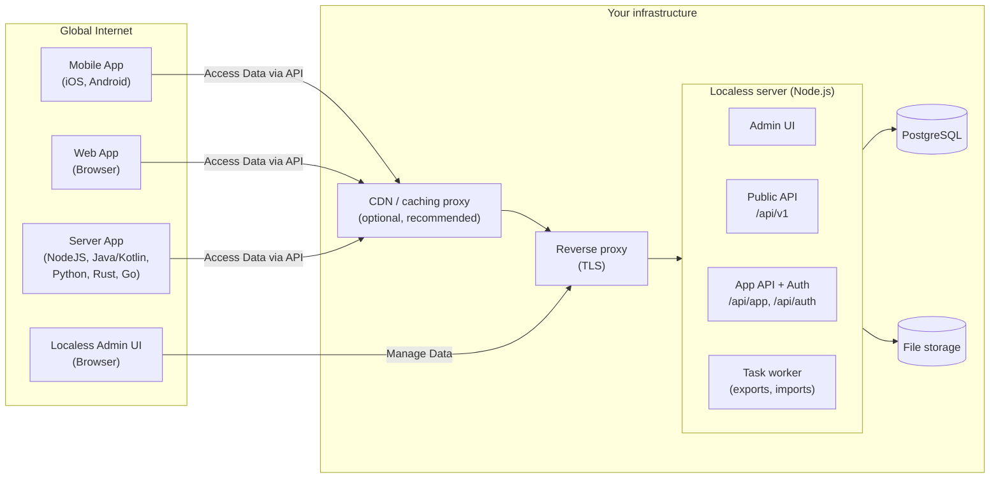

<br/>
<br/>

<br/>
<br/>

----


[](https://twitter.com/intent/tweet?text=Easy%20way%20to%20manage%20your%20app%20localisation&url=https://github.com/Lessify/localess&hashtags=i18n,internationalization,localization)


**Localess** is a powerful translation management tool and content management system built with **Angular** and **NestJS**, backed by **PostgreSQL**.
With **Localess**, you can easily manage and translate your website or app content into multiple languages, and it uses machine translation (DeepL or Google Cloud Translation) to translate faster.
The user-friendly interface makes it easy to navigate, and because it is a single self-hosted service, your content stays on infrastructure you control.
Whether you're a developer looking to expand your app's reach or a business owner looking to expand your online presence in new markets,
**Localess** is the perfect solution for your localization needs.

**Facts**

- It is **Free** forever, you or your company doesn't need to pay.
- It is **Open Source** Software, you also can contribute with code and feedback.
- It is **self-hosted**: one Docker container (plus Postgres, if you want one) — you pay only for the server you run it on.

## Translations


## Content


## Supporting Localess & Lessify Project

**Lessify** is an innovative software company focused on open-source technology and simplifying software for users.
With a commitment to transparency and collaboration, Lessify is dedicated to creating user-friendly software accessible to everyone.

**Localess** is part of the **Lessify Project**, is an open source project with its ongoing development made possible entirely by the support of Sponsors.

Our mission is to create software that's accessible, reliable, and easy to use.
By being sponsored on GitHub, we can focus on improving our projects and building a stronger community.
With your support, we can cover expenses such as hosting, development costs, and more while providing exclusive updates, features, and benefits.

Thank you for considering sponsoring us on GitHub!

## Key Features

- Translation Management Tool :
  - Edit your localisation content in real time.
  - Translate with machine translation (DeepL or Google Cloud Translation).
  - No application build required anymore.
- Content Management System :
  - Define shape of your content data with Schematics.
  - Define Validation for quality data.
  - Create hierarchical content.
- Low code platform.
- Publish your changes with instant application.
- CDN-ready public API (versioned URLs and `Cache-Control` headers, so any CDN or caching proxy can serve it).
- Easy way to migrate or back data with Import / Export feature.
- User Management with granular permissions; email + password, Google and Microsoft sign-in.
- Integration via API with any kind of application and language.

## Getting Started

Run Localess with Docker Compose (Localess + Postgres):

```bash
git clone https://github.com/Lessify/localess.git && cd localess
# set LOCALESS_PUBLIC_URL, LOCALESS_ADMIN_EMAIL and LOCALESS_ADMIN_PASSWORD in docker-compose.yml
docker compose up -d --build
```

Or as a single container with an embedded database:

```bash
docker build -t localess .
docker run -d -p 3000:3000 -v localess-data:/data \
  -e LOCALESS_ADMIN_EMAIL=admin@example.com -e LOCALESS_ADMIN_PASSWORD='change-me' \
  localess
```

Then open http://localhost:3000 and sign in with the admin account.

### Local development

Requires Node.js 24 and pnpm (Corepack provides the version pinned in `package.json`).

```bash
corepack enable                                                                           # provides pnpm
pnpm install                                                                              # every workspace (apps/*, packages/*)
LOCALESS_ADMIN_EMAIL=admin@example.com LOCALESS_ADMIN_PASSWORD=change-me pnpm server:dev  # API on :3000, embedded Postgres
pnpm start                                                                                # UI on :4200, proxies /api
```

## Documentation

1. [Overview](https://github.com/Lessify/localess/wiki)
2. [Integration](https://github.com/Lessify/localess/wiki/Integration)
3. Self-hosting:
   - [Deployment overview](docs/deployment/overview.md)
   - [Docker & Docker Compose](docs/deployment/docker.md)
   - [Configuration](docs/deployment/configuration.md) (all environment variables)
   - [Running in production](docs/deployment/production.md) (TLS, CDN, scaling)
   - [Updates, backups and rollback](docs/deployment/updates.md)
   - [Health check](docs/deployment/check.md)
   - [Migrating from a Firebase install](docs/deployment/migrate-from-firebase.md)

## How it works

**Localess** is one Node.js service: it serves the admin UI, the public API and runs background tasks.
Data lives in PostgreSQL (external, or embedded in the container) and uploaded files on disk.


```mermaid
flowchart LR
  subgraph Your infrastructure
    direction LR
    cdn["CDN / caching proxy<br/>(optional, recommended)"]
    proxy["Reverse proxy<br/>(TLS)"]
    subgraph Localess["Localess server (Node.js)"]
      direction LR
      ui["Admin UI"]
      api["Public API<br/>/api/v1"]
      app["App API + Auth<br/>/api/app, /api/auth"]
      worker["Task worker<br/>(exports, imports)"]
    end
    postgres[("PostgreSQL")]
    files[("File storage")]
    cdn --> proxy
    proxy --> Localess
    Localess --> postgres
    Localess --> files
  end
  subgraph Global Internet
    adminUI["Localess Admin UI<br/>(Browser)"]
    mobileApp["Mobile App<br/>(iOS, Android)"]
    webApp["Web App<br/>(Browser)"]
    serverApp["Server App<br/>(NodeJS, Java/Kotlin, <br/>Python, Rust, Go)"]
  end
  adminUI -->|Manage Data| proxy
  mobileApp -->|Access Data via API| cdn
  webApp -->|Access Data via API| cdn
  serverApp -->|Access Data via API| cdn
```

The admin UI talks to the server over a session-authenticated API and receives live updates via Server-Sent Events.
Published content and translations are served by the public API with versioned URLs and `Cache-Control` headers,
so a CDN in front of it answers most requests without reaching the server.

[//]: # 'netstat -aon | findstr 4000'
[//]: # 'taskkill /PID <PID> /F'
[//]: # 'docker build --tag=buildme .'
[//]: # 'git commit --amend --reset-author'
[//]: # 'git rebase -i main~4 main'
[//]: # 'git push origin +main'
[//]: # 'git rebase -i develop~4 develop'
[//]: # 'git push origin +develop'
